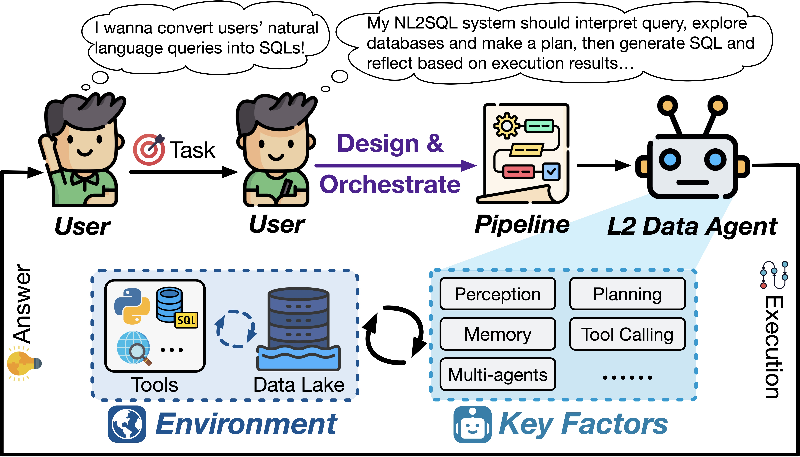
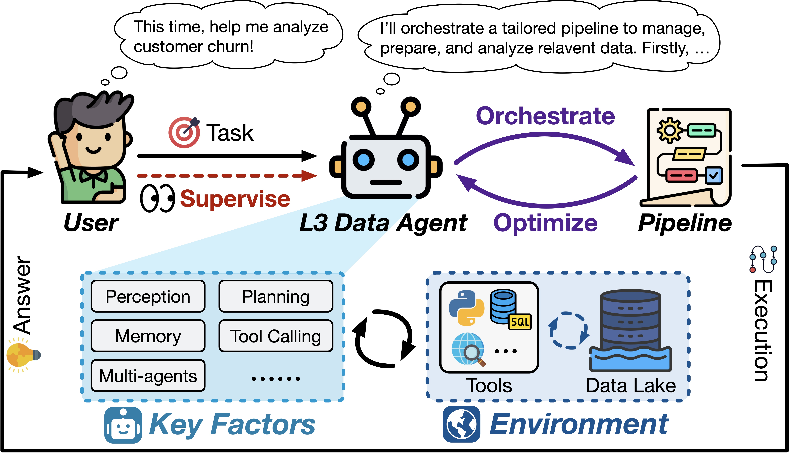

<h1 align="center">Awesome Data Agents</h1>
<div align="center">

[](https://awesome.re) 


</div>

> Curated papers and resources on **Data Agents** — from the perspective of proposed *autonomy levels*. Companion list for our (incoming) survey.

If you find this repository useful or inspiring, please kindly give us a star ⭐️ and cite our survey:

```bibtex
Coming soon
```

## Contents

- [Introduction](#introduction)
- [Levels of Data Agents](#levels-of-data-agents)
- [Paper List](#paper-list)

## Introduction

<p align="center"></p>

The way humans interact with data is undergoing a profound transformation. Data agents — LLM-powered systems designed to orchestrate the Data + AI ecosystem — are emerging as a promising solution for automating and democratizing data-related tasks across its lifecycle, from management and preparation to analysis.

However, the term "data agent" is currently used inconsistently across research and industry, resulting in considerable ambiguity. Systems with vastly different capabilities in autonomy, reliability, and task complexity are often labeled the same way. This creates a "Babel Tower" crisis where mismatched expectations and unclear accountability threaten to undermine user trust and impede healthy development of the field.

This repository — a companion to our survey — introduces a layered taxonomy (L0-L5) for data agents based on their degree of autonomy, providing a common framework to clarify capability boundaries and lines of accountability at each level.


## Levels of Data Agents

As mentioned above, to bring clarity to the diverse landscape of data agents, we propose a layered taxonomy based on their degree of autonomy. This framework maps the progressive shift of responsibility from human to agent, defining the distinct roles each plays at every stage, as summarized in the overview figure and the table below. 

| Level | Degree of Autonomy | Human Role | Data Agent Role |
|:-----:|------|------------|------------|
| L0 | Manual/No Autonomy | Dominator (Solo) | N/A (None) |
| L1 | Assisted | Dominator (Editing) | Assistant (Auxiliary) |
| L2 | Partial Autonomy | Dominator (Orchestrating) | Executor (Procedural) |
| L3 | Conditional Autonomy | Supervisor (Overseeing) | Dominator (Autonomous) |
| L4 | High Autonomy | Onlooker (Delegating) | Dominator (Proactive) |
| L5 | Full Autonomy | N/A (None) | Dominator (Generative) |

The transition between these levels represents more than just incremental progress; each step up the hierarchy requires a significant evolutionary leap as shown below. These leaps involve fundamental shifts in a data agent's capabilities—such as gaining environmental perception (L1→L2), achieving autonomous orchestrating and dominating the task (L2→L3), attaining proactive self-governance with supervision removed (L3→L4), or pioneering new paradigm (L4→L5).

<p align="center"></p>


## Paper List

We index papers **by autonomy level**, then **by data-related tasks** across Data Management, Data Preparation, and Data Analysis. Most existing work clusters in L1–L3, L4–L5 are aspirational

### L0-L1: From Manual Labor to Preliminary Assistance

In L0 level, data-related tasks are performed entirely by human experts without any automation. The process is completely human-driven, requiring extensive domain knowledge and solid technical expertise, making it highly specialized and time-consuming.

<p align="center"></p>

At L1 level, data agents start to have the capabilities to provide preliminary and single-point assistance through typical question-answering interactions. While they can help with atomic tasks like code peices generation, they lack environmental perception and require considerable human validation, editing, and optimization.

#### Data Management

- [Query Rewriting via LLMs](https://arxiv.org/abs/2502.12918) — *arXiv*
- [Query Performance Explanation through LLM for HTAP Systems](https://arxiv.org/abs/2412.01709) — *arXiv*
- [LLM-PM: Training-Free Query Optimization via LLM-Based Plan Mapping](https://arxiv.org/abs/2506.05853) — *arXiv*
- [Database is All You Need: Serving LLMs with Relational DBMS (EDBT'25)](https://openproceedings.org/2025/conf/edbt/paper-326.pdf) — *EDBT'25*

#### Data Preparation

##### Data Cleaning

- [LLMClean: Context-Aware Tabular Data Cleaning via LLM-Generated OFDs](https://arxiv.org/abs/2404.18681) — *arXiv*
- [LLM-GDO: Using Large Language Models for Generic Data Operators](https://arxiv.org/abs/2312.12051) — *arXiv*
- [HAIPipe: Combining Human-generated and Machine-generated Pipelines for Data Preparation (SIGMOD'23)](https://dl.acm.org/doi/10.1145/3588945) — *SIGMOD'23*

##### Data Integration

- [BoostER: Harnessing LLMs for Entity Resolution (WWW'24)](https://dl.acm.org/doi/10.1145/3589334.3645418) — *WWW'24*
- [Leveraging Large Language Models for Entity Matching](https://arxiv.org/abs/2407.05547) — *arXiv*
- [Entity Matching using Large Language Models](https://arxiv.org/pdf/2310.11244) — *arXiv*
- [Using ChatGPT for Entity Matching (ADBIS 2023)](https://link.springer.com/chapter/10.1007/978-3-031-42941-5_20) — *ADBIS 2023*
- [Cost-Effective In-Context Learning for Entity Resolution (ICDE'24)](https://ieeexplore.ieee.org/document/10598274) — *ICDE'24*

- [Schema Matching with Large Language Models: An Experimental Study (PVLDB'24)](https://arxiv.org/abs/2407.11852) — *PVLDB'24*
- [Magneto: Scaling Schema Matching by Combining Small and Large Language Models](https://arxiv.org/abs/2409.03166) — *arXiv*
- [Large Language Models for JSON Schema Discovery](https://arxiv.org/abs/2407.03286) — *arXiv*
- [LLM-Matcher: Zero-shot Text-to-Relational Schema Matching (VLDB'24 Demo)](https://www.vldb.org/pvldb/vol17/p4556-wu.pdf) — *VLDB'24*
- [Matchmaker: Self-Improving LLM Programs for Schema Matching](https://arxiv.org/abs/2410.24105) — *arXiv*
- [LLMs4SchemaDiscovery: A Human-in-the-Loop Workflow for Scientific Schema Discovery using LLMs](https://arxiv.org/abs/2504.00752) — *arXiv*

#### Data Analysis

##### TableQA (Structured)

- [Table Meets LLM: Can Large Language Models Understand Structured Table Data? A Benchmark and Empirical Study (WSDM'24)](https://dl.acm.org/doi/10.1145/3616855.3635752) — *WSDM'24*
- [TableLlama: Towards Open Large Generalist Models for Tables (NAACL'24)](https://arxiv.org/abs/2311.09206) — *NAACL'24*
- [Tab-CoT: Zero-shot Tabular Chain of Thought (ACL'23 Finding)](https://aclanthology.org/2023.findings-acl.651/) — *ACL'23*

##### NL2SQL (Structured)

- [Evaluating the Text-to-SQL Capabilities of Large Language Models](https://arxiv.org/pdf/2204.00498) — *arXiv*
- [C3: Zero-shot Text-to-SQL with ChatGPT](https://arxiv.org/abs/2307.07306) — *arXiv*
- [DIN-SQL: Decomposed In-Context Learning of Text-to-SQL with Self-Correction (NeurIPS'23)](https://arxiv.org/pdf/2304.11015) — *NeurIPS'23*
- [ACT-SQL: In-context learning for text-to-SQL with automatically-generated chain-of-thought (EMNLP'23 Finding)](https://aclanthology.org/2023.findings-emnlp.227/) — *EMNLP'23*
- [Text-to-SQL Empowered by Large Language Models: A Benchmark Evaluation (VLDB'24)](https://arxiv.org/abs/2308.15363) — *VLDB'24*

##### NL2VIS (Structured)

- [Data2Vis: Automatic Generation of Data Visualizations from Natural Language](https://arxiv.org/abs/1804.03126) — *arXiv*
- [Automated Data Visualization from Natural Language via Large Language Models (SIGMOD'2024)](https://arxiv.org/abs/2404.17136) — *SIGMOD'24*
- [Generating Analytic Specifications for Data Visualization from Natural Language Queries using Large Language Models (VIS'24 NLVIZ workshop)](https://arxiv.org/abs/2408.13391) — *VIS'24 NLVIZ workshop*
- [HAIChart: Human and AI Paired Visualization System (PVLDB'24)](https://www.vldb.org/pvldb/vol17/p3178-luo.pdf) — *PVLDB'24*

##### Unstructured

- [REPLUG: Retrieval-Augmented Black-Box Language Models (NAACL'24)](https://aclanthology.org/2024.naacl-long.463.pdf)  — *NAACL'24*
- [M3DocRAG: Multi-modal Retrieval is What You Need for Multi-page Multi-document Understanding](https://arxiv.org/pdf/2411.04952) — *arXiv*

##### Data Storytelling

- [ReportGPT: Human‑in‑the‑Loop Verifiable Table‑to‑Text Generation (EMNLP'24 Industry)](https://aclanthology.org/2024.emnlp-industry.39/)  — *EMNLP'24 Industry*

### L2: Perceive the Environment

<p align="center"></p>

At this level, data agents gain environmental perception and tool-invocation capabilities, enabling them to execute bounded sub-tasks and multi-step procedures. While they can follow human-orchestrated workflows, the overall process is still dominated by human direction.

#### Data Management

- [DB-GPT: Next-Generation Data Interaction System (PVLDB'24 Demo)](https://www.vldb.org/pvldb/vol17/p4365-chen.pdf) — *PVLDB'24*
- [GPTuner: A Manual-Reading Database Tuning System (PVLDB'24)](https://www.vldb.org/pvldb/vol17/p3727-su.pdf) — *PVLDB'24*
- [D-Bot: Database Diagnosis System using Large Language Models (PVLDB'24)](https://www.vldb.org/pvldb/vol17/p4220-wang.pdf) — *PVLDB'24*
- [Automatic Database Configuration Debugging using Retrieval-Augmented LMs](https://arxiv.org/abs/2412.19447) — *arXiv*
- [R-Bot: An LLM-based Query Rewrite System (PVLDB'25)](https://www.vldb.org/pvldb/vol18/p5031-li.pdf) — *PVLDB'25*
- [QUITE: A Query Rewrite System Beyond Rules with LLM Agents](https://arxiv.org/pdf/2506.07675) — *arXiv*

#### Data Preparation

##### Data Cleaning

- [ChatPipe: Orchestrating Data Preparation Pipelines by Optimizing Human–ChatGPT Interactions (SIGMOD'24 Demo)](https://dl.acm.org/doi/10.1145/3626246.3654727) — *SIGMOD'24*
- [CleanAgent: Automating Data Standardization with LLM-based Agents](https://arxiv.org/abs/2403.08291) — *arXiv*
- [AutoDCWorkflow: LLM-based Data Cleaning Workflow Auto-Generation](https://arxiv.org/abs/2412.06724) — *arXiv*
- [Text-to-Pipeline: Bridging Natural Language and Data Preparation Pipelines](https://arxiv.org/abs/2505.15874) — *arXiv*
- [Weak-to-Strong Prompts with Lightweight-to-Powerful LLMs for High-Accuracy, Low-Cost, and Explainable Data Transformation](https://www.vldb.org/pvldb/vol18/p2371-tang.pdf) — *VLDB'24*
- [Exploring LLM Agents for Cleaning Tabular Machine Learning Datasets (ICLR'25 Workshop on Foundation Models in the Wild)](https://arxiv.org/pdf/2503.06664) — *ICLR'25 Workshop on Foundation Models in the Wild*
- [AutoPrep: Natural Language Question-Aware Data Preparation with a Multi-Agent Framework (VLDB'25)](https://dbgroup.cs.tsinghua.edu.cn/ligl/papers/VLDB25-AutoPrep.pdf) — *VLDB'25*

##### Data Integration

- [Match, Compare, or Select? An Investigation of Large Language Models for Entity Matching (COLING'25)](https://aclanthology.org/2025.coling-main.8.pdf) — *COLING'25*
- [Agent-OM: Leveraging LLM Agents for Ontology Matching (PVLDB'25)](https://www.vldb.org/pvldb/vol18/p516-qiang.pdf) — *PVLDB'25*
- [Knowledge Graph-based Retrieval-Augmented Generation for Schema Matching](https://arxiv.org/pdf/2501.08686) — *arXiv*


#### Data Analysis

##### TableQA (Structured)

- [Binder: Binding Language Models in Symbolic Languages (ICLR'23)](https://arxiv.org/abs/2210.02875) — *ICLR'23*
- [StructGPT: A General Framework for Large Language Model on Structured Data (EMNLP'23)](https://arxiv.org/abs/2305.09645) — *EMNLP'23*
- [ReAcTable: Enhancing ReAct for Table Question Answering (VLDB'24)](https://dl.acm.org/doi/10.14778/3659437.3659452) — *VLDB'24*
- [Table-Critic: A Multi-Agent Framework for Collaborative Criticism and Refinement in Table Reasoning (ACL'25)](https://aclanthology.org/2025.acl-long.853.pdf) — *ACL'25*
- [Large Language Models are Versatile Decomposers: Decomposing Evidence and Questions for Table-based Reasoning (SIGIR'23)](https://dl.acm.org/doi/pdf/10.1145/3539618.3591708) — *SIGIR'23*
- [Chain-of-Table: Evolving Tables in the Reasoning Chain for Table Understanding (ICLR'24)](https://openreview.net/forum?id=4L0xnS4GQM) — *ICLR'24*
- [AutoTQA: Towards Autonomous Tabular Question Answering through Multi-Agent Large Language Models (PVLDB'24)](http://dl.acm.org/doi/10.14778/3685800.3685816) — *PVLDB'24*
- [TableMaster: A Recipe to Advance Table Understanding with Language Models](https://arxiv.org/pdf/2501.19378) — *arXiv*

##### NL2SQL (Structured)

- [CHASE-SQL: Multi-Path Reasoning and Preference Optimization for Text-to-SQL (ICLR'25)](https://proceedings.iclr.cc/paper_files/paper/2025/file/974ff7b5bf08dbf9400b5d599a39c77f-Paper-Conference.pdf) — *ICLR'25*
- [MAC-SQL: A Multi-Agent Collaborative Framework for Text-to-SQL (COLING'25)](https://arxiv.org/abs/2312.11242) — *COLING'25*
- [Alpha-SQL: Zero-Shot Text-to-SQL using Monte Carlo Tree Search](https://arxiv.org/abs/2502.17248) — *arXiv*
- [ReFoRCE: A Text-to-SQL Agent with Self-Refinement, Consensus Enforcement, and Column Exploration](https://arxiv.org/abs/2502.00675) — *arXiv*
- [ChatBI: Towards Natural Language to Complex Business Intelligence SQL (arXiv'24)](https://arxiv.org/pdf/2405.00527) — *arXiv*

##### NL2VIS (Structured)

- [MatPlotAgent: Method and Evaluation for LLM-Based Agentic Scientific Data Visualization](https://arxiv.org/pdf/2402.11453) — *arXiv*
- [DeepVIS: Bridging Natural Language and Data Visualization Through Step-wise Reasoning (VIS'25)](https://arxiv.org/pdf/2508.01700) — *VIS'25*
- [C2: Scalable Auto-Feedback for LLM-based Chart Generation (NAACL'25)](https://aclanthology.org/2025.naacl-long.232/) — *NAACL'25*
- [PlotGen: Multi-Agent LLM-based Scientific Data Visualization via Multimodal Feedback (WWW'25)](https://www.arxiv.org/pdf/2502.00988) — *WWW'25*
- [nvAgent: Automated Data Visualization from Natural Language via Collaborative Agent Workflow (ACL'25)](https://aclanthology.org/2025.acl-long.960/) — *ACL'25*

##### Data Storytelling

- [DataNarrative: Automated Data-Driven Storytelling with Visualizations and Texts (EMNLP'24)](https://aclanthology.org/2024.emnlp-main.1073/) — *EMNLP'24*
- [Multimodal DeepResearcher: Generating Text–Chart Interleaved Reports with an Agentic Framework (arXiv'25)](https://arxiv.org/abs/2506.02454) — *arXiv*

##### Unstructured

- [QUEST: Query Optimization in Unstructured Document Analysis (VLDB'25)](https://arxiv.org/abs/2507.06515) — *VLDB'25*

#### Data System

- [Semantic Operators: A Declarative Model for Rich, AI-Augmented Data Analytics](https://arxiv.org/abs/2407.11418) — *arXiv*
- [LAMBDA: A Large Model Based Data Agent](https://arxiv.org/pdf/2407.17535) — *arXiv*
- [InfiAgent-DABench: Evaluating Agents on Data Analysis Tasks (ICML'24)](https://proceedings.mlr.press/v235/hu24s.html) — *ICML'24*

### Proto-L3: Striving for Autonomous Data Agents

<p align="center"></p>

Level L3 marks a critical transition where data agents evolve from procedural executors into autonomous directors for data-related tasks. At this stage, they can independently decompose high-level goals, orchestrate and optimize tailored, end-to-end pipelines, shifting the human to a supervisory role. While recent pioneering efforts show promise, they are largely considered very early-stage "Proto-L3" systems. Consequently, the pursuit of more autonomous, reliable, versitile and comprehensive L3 data agents remains a key objective in both academia and industry.

#### Data Management

- [DBAIOps: A Reasoning LLM-Enhanced Database Operation and Maintenance System using Knowledge Graphs](https://arxiv.org/pdf/2508.01136) — *arXiv*
- [GaussMaster: An LLM-based Database Copilot System](https://arxiv.org/pdf/2506.23322) — *arXiv*

#### Data Analysis

##### Unstructured

- [Unify: A System For Unstructured Data Analytics (ICDE'25)](https://dbgroup.cs.tsinghua.edu.cn/ligl//papers/Unify.pdf) — *ICDE'25*
- [DataMosaic: Explainable and Verifiable Multi-Modal Data Analytics through Extract–Reason–Verify (arXiv'25)](https://arxiv.org/abs/2504.10036) — *arXiv*

#### Data System

- [Chat2Data: An Interactive Data Analysis System with RAG, Vector Databases and LLMs (VLDB'24 demo)](https://dl.acm.org/doi/pdf/10.14778/3685800.3685905) — *VLDB'24*
- [DataMosaic: Explainable and Verifiable Multi-Modal Data Analytics through Extract–Reason–Verify (arXiv'25)](https://arxiv.org/abs/2504.10036) — *arXiv*
- [Data Interpreter: An LLM Agent For Data Science (Findings ACL'25)](https://aclanthology.org/2025.findings-acl.1016/) — *ACL'25*
- [AOP: Automated and Interactive LLM Pipeline Orchestration for Answering Complex Queries (CIDR'25)](https://www.cidrdb.org/cidr2025/papers/p32-wang.pdf) — *CIDR'25*
- [Palimpzest: Optimizing AI‑Powered Analytics with Declarative Query Processing (CIDR'25)](https://mail.vldb.org/cidrdb/papers/2025/p12-liu.pdf) — *CIDR'25*
- [AgenticData: An Agentic Data Analytics System for Heterogeneous Data (arXiv'25)](https://arxiv.org/abs/2508.05002) — *arXiv*
- [SPIO: Ensemble and Selective Strategies via LLM-Based Multi-Agent Planning in Automated Data Science](https://arxiv.org/pdf/2503.23314) — *arXiv*
- [Data Agent: A Holistic Architecture for Orchestrating Data+AI Ecosystems](https://arxiv.org/abs/2507.01599) — *arXiv*

### L4-L5: Vision towards Proactive and Generative Data Agents

#### L4: Vision of Proactive Data Agents

Data agents at L4 can achieve sustained self-governance with proactive monitoring and optimization across the data lifecycle. They can operate autonomously for extended periods without human supervision, actively providing insights and feedback while maintaining reliability.

<p align="center"></p>

#### L5: The Ultimate Vision of Ubiquitous and Generative Data Agents

The ultimate vision of fully autonomous data agents that can function as expert data scientists, capable of knowledge creation and paradigm innovation for data-related tasks.


